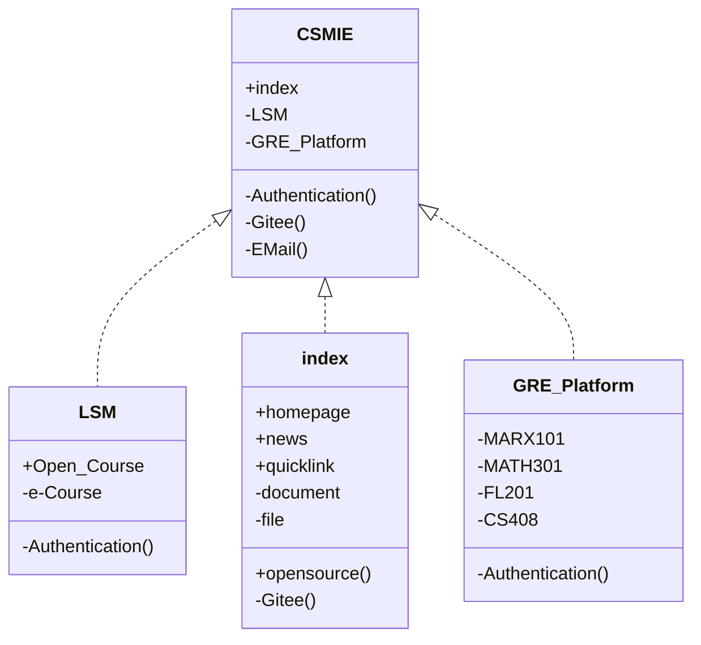

>  migration project !!

# Computer Science and Medical Interdisciplinary Engineering

## Introduction

The goal of the Department of Computer Science and Medical Interdisciplinary Engineering (CSMIE) is to cultivate professionals with knowledge in both computer science and medicine, and to promote the application and innovation of computer technology in the field of medicine. CMME offers a rich curriculum and research opportunities, attracting many students and researchers to explore this field.

The curriculum at CSMIE covers computer science, biomedical engineering, and medical-related disciplines. Students can learn computer programming, data analysis, artificial intelligence, machine learning, and other fundamental knowledge in computer science. At the same time, they can also learn professional knowledge in the medical field, such as medical image processing, bioinformatics, medical data analysis, etc. These courses aim to help students build a bridge between computer science and medicine, laying a solid foundation for their future research and work.

CSMIE emphasizes international horizon and competitiveness. CSMIE is dedicated to cultivating professionals in the interdisciplinary field of computer science and medicine. Through a rich curriculum, practical opportunities, and research projects, the college provides students with comprehensive education and training. Students can learn knowledge in computer science and medicine, master relevant skills, and apply them to innovation and development in the medical field. CSMIE is committed to promoting the application of computer technology in the field of medicine and contributing to the development of the healthcare industry.

## Configuration

## LSM

### 1. About Us

"e-Course @ Computer Science and Technology"(e-Course) system is a lightweight teaching auxiliary website. You can browse your courses and course related materials in this website. In addition, e-Course is committed to providing students with targeted extracurricular resources for students to better learn the course.

### 2. Privacy Notice
e-Course is committed to protecting the privacy of students and others who visit and use our websites and online services. By accessing, viewing, or otherwise using the e-Course @ Computer Science and Technology (the “Site”) websites and services you acknowledge the Privacy Notice.

### 3. Use of the Site; Compliance With Laws.
We appreciate your interest in the Site. This Site is made available for informational purposes. You may use this Site only for your own personal viewing and non-commercial use.

Viewing and/or use of the Site is subject to the terms appearing in these Notices, which may be updated from time to time by e-Course. Please be aware that certain pages linked to and/or included in the Site may include additional posted terms and/or policies. By accessing and/or using any portion of the Site, you are agreeing to the then-current terms and/or policies applicable to such portions of the Site, in addition to these terms.

This Site is based in the China and intended only for the use of those who may legally access and use the Site under relevant P.R.C. laws and regulations. You agree to use this Site in compliance with any and all applicable laws and regulations. You may not use the Site for any unlawful purpose or engage in any conduct which restricts other users from enjoying the Site.

### 4. Disclaimers; Links to Other Sites.
This Site is made available on an AS-IS, WHERE IS basis for informational purposes, and any and all implied warranties or duties are hereby disclaimed. This Site includes links to third-party sites which are not under the control of Site. The Site is not responsible for the content or operation of such sites, which may have their own terms. The inclusion a link to a third-party site does not imply endorsement by e-Course @ Computer Science and Technology.

## Authentication

Authentication is the process of determining whether someone or something is, in fact, who or what it says it is. Authentication technology provides access control for systems by checking to see if a user's credentials match the credentials in a database of authorized users or in a data authentication server. In doing this, authentication assures secure systems, secure processes and enterprise information security.

## Open Course

The open course platform is an online learning platform aimed at providing high-quality online educational resources. Through the open course platform, students can independently study outside the classroom, and teachers can easily create and share their teaching resources, promoting the improvement of teaching quality and efficiency.

The courses offered by the open course platform cover various academic fields, including humanities, social sciences, natural sciences, professional education, and more. These courses are selected from planned courses, online courses, etc., and presented in high-definition videos, audios, and texts, allowing students outside the plan to learn anytime and anywhere.

The open course platform is a powerful online learning tool that can help students learn independently outside the classroom and improve their abilities and accomplishments. With the continuous development and innovation of online education, the open course platform will receive more attention and favor.

## PEGG Platform

The Postgraduate Entrance Examination (PGEE) is a standardized test in China that assesses the academic abilities and potential of undergraduate students who wish to pursue postgraduate education. The exam is usually held annually in December and January, and it covers various academic fields, including humanities, social sciences, natural sciences, engineering, and more.

The PGEE consists of two parts: the National Unified Examination and the Professional Subject Examination. The National Unified Examination includes tests on Chinese, English, and comprehensive ability, while the Professional Subject Examination focuses on the specific academic field the candidate wishes to pursue.

The PGEE is a highly competitive exam, with a large number of candidates applying for limited postgraduate positions in top universities. Therefore, candidates need to prepare thoroughly for the exam by reviewing their undergraduate knowledge, mastering test-taking skills, and improving their language proficiency.

While the PGEE is a challenging exam, it also provides opportunities for students to further their education and achieve their career goals. Many top universities in China offer excellent postgraduate programs that can help students advance their knowledge and skills in their chosen fields.