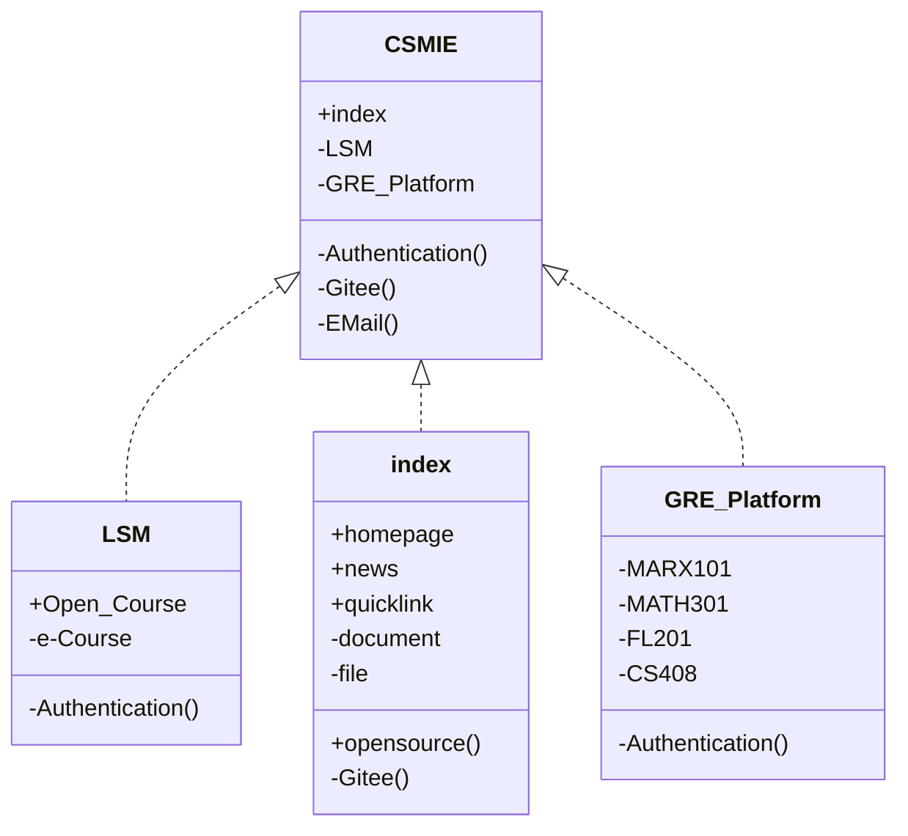

# Computer Science and Medical Interdisciplinary Engineering

## Introduction

The goal of the Department of Computer Science and Medical Interdisciplinary Engineering (CSMIE) is to cultivate professionals with knowledge in both computer science and medicine, and to promote the application and innovation of computer technology in the field of medicine. CMME offers a rich curriculum and research opportunities, attracting many students and researchers to explore this field.

The curriculum at CSMIE covers computer science, biomedical engineering, and medical-related disciplines. Students can learn computer programming, data analysis, artificial intelligence, machine learning, and other fundamental knowledge in computer science. At the same time, they can also learn professional knowledge in the medical field, such as medical image processing, bioinformatics, medical data analysis, etc. These courses aim to help students build a bridge between computer science and medicine, laying a solid foundation for their future research and work.

CSMIE emphasizes international horizon and competitiveness. CSMIE is dedicated to cultivating professionals in the interdisciplinary field of computer science and medicine. Through a rich curriculum, practical opportunities, and research projects, the college provides students with comprehensive education and training. Students can learn knowledge in computer science and medicine, master relevant skills, and apply them to innovation and development in the medical field. CSMIE is committed to promoting the application of computer technology in the field of medicine and contributing to the development of the healthcare industry.

## Configuration
<<<<<<< HEAD

